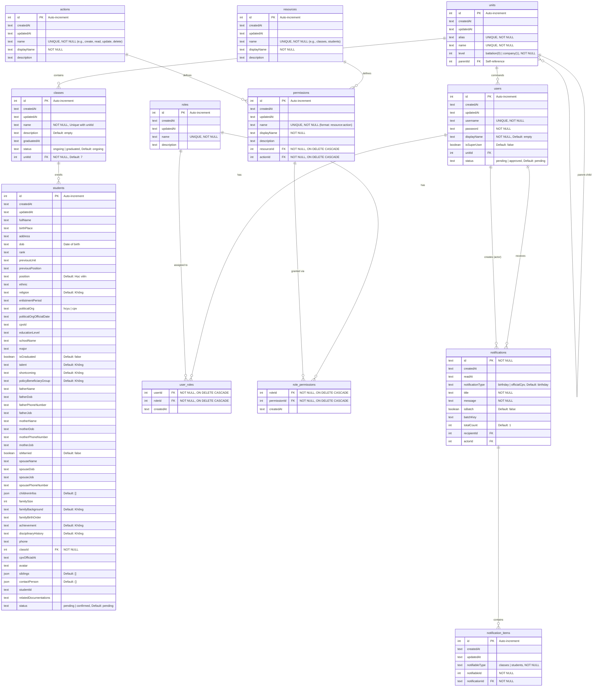

# Database Entity Relationship Diagram (ERD)

**Application:** Student Management System API
**Database:** SQLite (LibSQL)
**ORM:** Drizzle ORM
**Last Updated:** 2025-11-28

---

## Table of Contents

1. [ERD Diagram](#erd-diagram)
2. [Tables Overview](#tables-overview)
3. [Core Domain Tables](#core-domain-tables)
4. [Authorization & Permissions Tables](#authorization--permissions-tables)
5. [Notification Tables](#notification-tables)
6. [Relationships Summary](#relationships-summary)
7. [Indexes](#indexes)
8. [Constraints](#constraints)

---

## ERD Diagram



---

## Tables Overview

| Table | Purpose | Record Count Type |
|-------|---------|------------------|
| `students` | Student records with personal, family, and educational info | High volume |
| `classes` | Class/course information | Medium volume |
| `units` | Organizational units (battalion/company hierarchy) | Low volume |
| `users` | System users with authentication | Low-Medium volume |
| `roles` | User roles for RBAC | Low volume |
| `user_roles` | Many-to-many: Users ↔ Roles | Medium volume |
| `permissions` | System permissions (resource:action pairs) | Low-Medium volume |
| `role_permissions` | Many-to-many: Roles ↔ Permissions | Medium volume |
| `resources` | Protected resources (e.g., students, classes) | Very low volume |
| `actions` | CRUD operations (create, read, update, delete) | Very low volume |
| `notifications` | User notifications | High volume |
| `notification_items` | Items referenced by batch notifications | High volume |

---

## Core Domain Tables

### 1. students

**Purpose:** Store comprehensive student information including personal details, family background, education, and political organization membership.

**Key Fields:**
- Personal: `fullName`, `dob`, `birthPlace`, `address`, `phone`, `ethnic`, `religion`
- Military: `rank`, `position`, `previousUnit`, `enlistmentPeriod`
- Political: `politicalOrg` (hcyu/cpv), `cpvId`, `cpvOfficialAt`
- Education: `educationLevel`, `schoolName`, `major`, `isGraduated`
- Family: Father/mother/spouse info, `childrenInfos` (JSON), `siblings` (JSON)
- Status: `status` (pending/confirmed)

**Relationships:**
- **Many-to-One** → `classes` (via `classId`)

**Constraints:**
- `classId` NOT NULL (every student must belong to a class)
- `politicalOrg` must be 'hcyu' or 'cpv'
- `status` must be 'pending' or 'confirmed'

**JSON Fields:**
- `childrenInfos`: Array of children information
- `siblings`: Array of sibling information
- `contactPerson`: Emergency contact object

---

### 2. classes

**Purpose:** Represent classes/courses within organizational units.

**Key Fields:**
- `name`: Class name (unique per unit)
- `description`: Class description
- `status`: 'ongoing' or 'graduated'
- `graduatedAt`: Graduation date
- `unitId`: Parent unit (company level)

**Relationships:**
- **Many-to-One** → `units` (via `unitId`)
- **One-to-Many** → `students`
- **One-to-Many** → `users` (class instructors/commanders)

**Constraints:**
- UNIQUE constraint on (`name`, `unitId`) - no duplicate class names within a unit
- `unitId` defaults to 7
- Unit must be at 'company' level (not 'battalion')

---

### 3. units

**Purpose:** Hierarchical organizational structure (battalion → company).

**Key Fields:**
- `alias`: Short unique identifier
- `name`: Full unit name
- `level`: 0 (battalion) or 1 (company)
- `parentId`: Reference to parent unit (self-referencing)

**Relationships:**
- **Self-referencing**: `parentId` → `id` (parent-child hierarchy)
- **One-to-Many** → `classes` (companies have classes)
- **One-to-Many** → `users` (unit commanders)

**Constraints:**
- `alias` and `name` must be UNIQUE
- Hierarchy: Battalion (level 0) contains Companies (level 1)
- Custom enum type stores level as integer (0/1) but presents as string (battalion/company)

**Hierarchy Example:**
```
Battalion (level 0, parentId: NULL)
  └─ Company A (level 1, parentId: battalion.id)
      └─ Class 1
      └─ Class 2
  └─ Company B (level 1, parentId: battalion.id)
      └─ Class 3
```

---

## Authorization & Permissions Tables

### RBAC (Role-Based Access Control) System

The application implements a comprehensive RBAC system with the following structure:

```
Users → Roles → Permissions → (Resources + Actions)
```

### 4. users

**Purpose:** System users with authentication and authorization.

**Key Fields:**
- `username`: Unique login identifier
- `password`: Hashed password
- `displayName`: User's display name
- `isSuperUser`: Super admin flag
- `unitId`: Associated organizational unit
- `status`: 'pending' or 'approved'

**Relationships:**
- **Many-to-One** → `units` (via `unitId`)
- **Many-to-Many** → `roles` (via `user_roles`)
- **One-to-Many** → `notifications` (as recipient)
- **One-to-Many** → `notifications` (as actor/creator)

**Constraints:**
- `username` must be UNIQUE
- `password` is required (should be hashed)

---

### 5. roles

**Purpose:** Define user roles in the system.

**Key Fields:**
- `name`: Role name (unique)
- `description`: Role description

**Relationships:**
- **Many-to-Many** → `users` (via `user_roles`)
- **Many-to-Many** → `permissions` (via `role_permissions`)

**Examples:**
- Super Administrator
- Unit Commander
- Class Instructor
- Student Viewer

---

### 6. user_roles (Junction Table)

**Purpose:** Many-to-many relationship between users and roles.

**Key Fields:**
- `userId`: Foreign key to users
- `roleId`: Foreign key to roles
- `createdAt`: Assignment timestamp

**Primary Key:** Composite (`userId`, `roleId`)

**Constraints:**
- ON DELETE CASCADE on both foreign keys
- A user can have multiple roles
- A role can be assigned to multiple users

---

### 7. permissions

**Purpose:** Define granular permissions for system resources.

**Key Fields:**
- `name`: Auto-generated format `resource:action` (e.g., "students:create")
- `displayName`: Human-readable name (e.g., "Create Students")
- `description`: Permission description
- `resourceId`: FK to resources table
- `actionId`: FK to actions table

**Relationships:**
- **Many-to-One** → `resources`
- **Many-to-One** → `actions`
- **Many-to-Many** → `roles` (via `role_permissions`)

**Constraints:**
- `name` must be UNIQUE
- ON DELETE CASCADE on resource and action FKs

**Permission Examples:**
- `students:read` - View student records
- `students:create` - Create new students
- `classes:update` - Modify class information
- `users:delete` - Delete user accounts

---

### 8. role_permissions (Junction Table)

**Purpose:** Many-to-many relationship between roles and permissions.

**Key Fields:**
- `roleId`: Foreign key to roles
- `permissionId`: Foreign key to permissions
- `createdAt`: Grant timestamp

**Primary Key:** Composite (`roleId`, `permissionId`)

**Constraints:**
- ON DELETE CASCADE on both foreign keys

---

### 9. resources

**Purpose:** Define protected resources in the system.

**Key Fields:**
- `name`: Resource identifier (e.g., "students", "classes", "units")
- `displayName`: Human-readable name
- `description`: Resource description

**Relationships:**
- **One-to-Many** → `permissions`

**Examples:**
- students - Student Records
- classes - Class Information
- units - Organizational Units
- users - User Accounts

---

### 10. actions

**Purpose:** Define operations that can be performed on resources.

**Key Fields:**
- `name`: Action identifier (e.g., "create", "read", "update", "delete")
- `displayName`: Human-readable name
- `description`: Action description

**Relationships:**
- **One-to-Many** → `permissions`

**Standard Actions:**
- create - Create new records
- read - View/list records
- update - Modify existing records
- delete - Remove records

---

## Notification Tables

### 11. notifications

**Purpose:** Store user notifications for events like birthdays and CPV official dates.

**Key Fields:**
- `id`: Text UUID (primary key)
- `notificationType`: 'birthday' or 'officialCpv'
- `title`: Notification title
- `message`: Notification body
- `isBatch`: Whether this is a batch notification
- `batchKey`: Key for grouping batch notifications
- `totalCount`: Number of items in batch
- `recipientId`: User receiving the notification
- `actorId`: User who triggered the notification
- `readAt`: Timestamp when notification was read

**Relationships:**
- **Many-to-One** → `users` (recipient)
- **Many-to-One** → `users` (actor)
- **One-to-Many** → `notification_items`

**Indexes:**
- `recipient_idx` on `recipientId` (fast lookup of user's notifications)
- `batch_idx` on `batchKey` (fast lookup of batch notifications)

---

### 12. notification_items

**Purpose:** Store individual items (students/classes) referenced in batch notifications.

**Key Fields:**
- `notifiableType`: 'students' or 'classes'
- `notifiableId`: ID of the student or class
- `notificationId`: FK to parent notification

**Relationships:**
- **Many-to-One** → `notifications`

**Indexes:**
- `notification_items_notification_idx` on `notificationId`
- `notification_items_item_idx` on (`notifiableType`, `notifiableId`)

**Use Case:**
A birthday notification can reference multiple students:
```
Notification (id: "uuid-123", title: "5 students have birthdays this week")
  ├─ NotificationItem (notifiableType: "students", notifiableId: 101)
  ├─ NotificationItem (notifiableType: "students", notifiableId: 102)
  ├─ NotificationItem (notifiableType: "students", notifiableId: 103)
  ├─ NotificationItem (notifiableType: "students", notifiableId: 104)
  └─ NotificationItem (notifiableType: "students", notifiableId: 105)
```

---

## Relationships Summary

### One-to-Many Relationships

| Parent Table | Child Table | Foreign Key | Relationship |
|-------------|-------------|-------------|--------------|
| `units` | `units` | `parentId` | Self-referencing hierarchy |
| `units` | `classes` | `unitId` | Unit contains classes |
| `units` | `users` | `unitId` | Unit has commanders |
| `classes` | `students` | `classId` | Class enrolls students |
| `resources` | `permissions` | `resourceId` | Resource has permissions |
| `actions` | `permissions` | `actionId` | Action defines permissions |
| `users` | `notifications` | `recipientId` | User receives notifications |
| `users` | `notifications` | `actorId` | User creates notifications |
| `notifications` | `notification_items` | `notificationId` | Notification contains items |

### Many-to-Many Relationships

| Table 1 | Junction Table | Table 2 | Purpose |
|---------|---------------|---------|---------|
| `users` | `user_roles` | `roles` | Users have multiple roles |
| `roles` | `role_permissions` | `permissions` | Roles grant permissions |

### Relationship Cardinality

```
units (1) ──────< (N) classes
  │
  └──────< (N) units (self-reference)
  │
  └──────< (N) users

classes (1) ──────< (N) students

users (N) >────< (N) roles
      (via user_roles)

roles (N) >────< (N) permissions
      (via role_permissions)

permissions (N) >────── (1) resources
                │
                └────── (1) actions

notifications (1) ──────< (N) notification_items
```

---

## Indexes

### Performance Indexes

| Table | Index Name | Columns | Purpose |
|-------|-----------|---------|---------|
| `notifications` | `recipient_idx` | `recipientId` | Fast user notification lookup |
| `notifications` | `batch_idx` | `batchKey` | Fast batch notification grouping |
| `notification_items` | `notification_items_notification_idx` | `notificationId` | Fast item lookup by notification |
| `notification_items` | `notification_items_item_idx` | `notifiableType`, `notifiableId` | Fast lookup by referenced entity |

### Primary Key Indexes (Automatic)

All tables have primary key indexes on `id` except:
- `user_roles`: Composite PK on (`userId`, `roleId`)
- `role_permissions`: Composite PK on (`roleId`, `permissionId`)
- `notifications`: PK on `id` (text UUID)

---

## Constraints

### Unique Constraints

| Table | Columns | Constraint Name |
|-------|---------|----------------|
| `units` | `alias` | Unique |
| `units` | `name` | Unique |
| `classes` | `name`, `unitId` | `class_unit_unique_constraint` |
| `users` | `username` | Unique |
| `roles` | `name` | Unique |
| `permissions` | `name` | Unique |
| `resources` | `name` | Unique |
| `actions` | `name` | Unique |

### Foreign Key Constraints

#### With CASCADE DELETE

| Child Table | Parent Table | FK Column | Action |
|------------|-------------|-----------|--------|
| `user_roles` | `users` | `userId` | ON DELETE CASCADE |
| `user_roles` | `roles` | `roleId` | ON DELETE CASCADE |
| `role_permissions` | `roles` | `roleId` | ON DELETE CASCADE |
| `role_permissions` | `permissions` | `permissionId` | ON DELETE CASCADE |
| `permissions` | `resources` | `resourceId` | ON DELETE CASCADE |
| `permissions` | `actions` | `actionId` | ON DELETE CASCADE |

#### Without CASCADE

| Child Table | Parent Table | FK Column | Notes |
|------------|-------------|-----------|-------|
| `units` | `units` | `parentId` | Self-reference |
| `classes` | `units` | `unitId` | Required |
| `students` | `classes` | `classId` | Required |
| `users` | `units` | `unitId` | Optional |
| `notifications` | `users` | `recipientId` | Optional |
| `notifications` | `users` | `actorId` | Optional |
| `notification_items` | `notifications` | `notificationId` | Required |

### Check Constraints (Custom Types)

| Table | Column | Valid Values |
|-------|--------|--------------|
| `students` | `politicalOrg` | 'hcyu', 'cpv' |
| `students` | `status` | 'pending', 'confirmed' |
| `classes` | `status` | 'ongoing', 'graduated' |
| `units` | `level` | 0 (battalion), 1 (company) |
| `users` | `status` | 'pending', 'approved' |
| `notifications` | `notificationType` | 'birthday', 'officialCpv' |
| `notification_items` | `notifiableType` | 'classes', 'students' |

---

## Base Schema Pattern

All tables (except junction tables) inherit from a base schema:

```typescript
{
  id: integer PRIMARY KEY AUTO_INCREMENT,
  createdAt: text DEFAULT CURRENT_TIMESTAMP,
  updatedAt: text DEFAULT CURRENT_TIMESTAMP (auto-updates on change)
}
```

**Exceptions:**
- `notifications`: Uses text UUID for `id`
- `user_roles`: Composite PK, only has `createdAt`
- `role_permissions`: Composite PK, only has `createdAt`

---

## Data Types

### SQLite Column Types

| Drizzle Type | SQLite Type | Usage |
|-------------|-------------|-------|
| `sqlite.int()` | INTEGER | IDs, foreign keys, boolean (0/1) |
| `sqlite.text()` | TEXT | Strings, dates (ISO format), JSON |
| `sqlite.int({ mode: 'boolean' })` | INTEGER | Boolean values (0/1) |
| `sqlite.text({ mode: 'json' })` | TEXT | JSON arrays/objects |
| Custom types | TEXT/INTEGER | Enums with validation |

### Custom Enum Types

| Table | Column | Storage | Runtime Type |
|-------|--------|---------|--------------|
| `units` | `level` | INTEGER (0/1) | 'battalion' \| 'company' |
| `students` | `politicalOrg` | TEXT | 'hcyu' \| 'cpv' |
| `students` | `status` | TEXT | 'pending' \| 'confirmed' |
| `classes` | `status` | TEXT | 'ongoing' \| 'graduated' |
| `users` | `status` | TEXT | 'pending' \| 'approved' |
| `notifications` | `notificationType` | TEXT | 'birthday' \| 'officialCpv' |
| `notification_items` | `notifiableType` | TEXT | 'classes' \| 'students' |

---

## Query Patterns

### Common Joins

#### Get students with class and unit info
```typescript
db.query.students.findMany({
  with: {
    class: {
      with: { unit: true }
    }
  }
})
```

#### Get classes with student count
```typescript
db.select({
  ...getTableColumns(classes),
  studentCount: count(students.classId)
})
.from(classes)
.leftJoin(students, eq(classes.id, students.classId))
.groupBy(classes.id)
```

#### Get user permissions
```typescript
db.select({
  permissionName: permissions.name,
  resourceName: resources.name,
  actionName: actions.name
})
.from(users)
.innerJoin(userRoles, eq(users.id, userRoles.userId))
.innerJoin(roles, eq(userRoles.roleId, roles.id))
.innerJoin(rolePermissions, eq(roles.id, rolePermissions.roleId))
.innerJoin(permissions, eq(rolePermissions.permissionId, permissions.id))
.innerJoin(resources, eq(permissions.resourceId, resources.id))
.innerJoin(actions, eq(permissions.actionId, actions.id))
.where(eq(users.id, userId))
```

#### Get unit hierarchy
```typescript
db.query.units.findMany({
  with: {
    children: {
      with: { classes: true }
    },
    parent: true
  }
})
```

---

## Database File

**Location:** `apps/api/local.db`
**Type:** LibSQL (SQLite-compatible)
**Connection:** File-based (`file:local.db`)
**Migrations:** Auto-applied from `./migrations` folder on startup

---

## Schema Files

All schema definitions are located in `apps/api/schema/`:

| File | Tables Defined |
|------|----------------|
| `base.ts` | Base schema pattern (id, createdAt, updatedAt) |
| `student.ts` | `students` table and types |
| `classes.ts` | `classes` table and types |
| `units.ts` | `units` table and types |
| `users.ts` | `users` table and types |
| `roles.ts` | `roles` table and types |
| `user-roles.ts` | `user_roles` junction table |
| `permissions.ts` | `permissions` table and types |
| `role-permissions.ts` | `role_permissions` junction table |
| `resources.ts` | `resources` table and types |
| `actions.ts` | `actions` table and types |
| `notifications.ts` | `notifications` table and types |
| `notification-items.ts` | `notification_items` table and types |
| `index.ts` | Exports all schemas |

---


## Generate Migrations
```bash
encore exec -- pnpm generate
```
Generates Drizzle migrations based on schema changes in `apps/api/schema/`.

## Run Migrations
```bash
encore exec -- pnpm migrate
```
Runs pending migrations against the database.

## Workflow
When creating new fields or modifying schema:

1. **Generate migrations**: Run `encore exec -- pnpm generate` to create migration files from schema changes
2. **Apply migrations**: Run `encore exec -- pnpm migrate` to apply the migrations to the database

**Important**: Always use generate + migrate workflow. Do not use `pnpm push` for schema changes.


## Notes

1. **Timestamps:** All timestamps are stored as TEXT in ISO 8601 format
2. **Auto-increment:** All IDs (except notifications) use auto-increment integers
3. **JSON Fields:** JSON data is stored as TEXT and parsed by Drizzle ORM
4. **Soft Deletes:** Not implemented - deletions are hard deletes
5. **Audit Trail:** Base schema includes `createdAt` and `updatedAt` for all tables
6. **Validation:** Custom enum types provide runtime validation on insert/update
7. **Cascading:** User and role deletions cascade to junction tables
8. **Self-referencing:** Units table supports hierarchical structure via `parentId`

---

**Generated by:** Claude Code
**Database ORM:** Drizzle ORM
**Database Engine:** LibSQL (SQLite)
